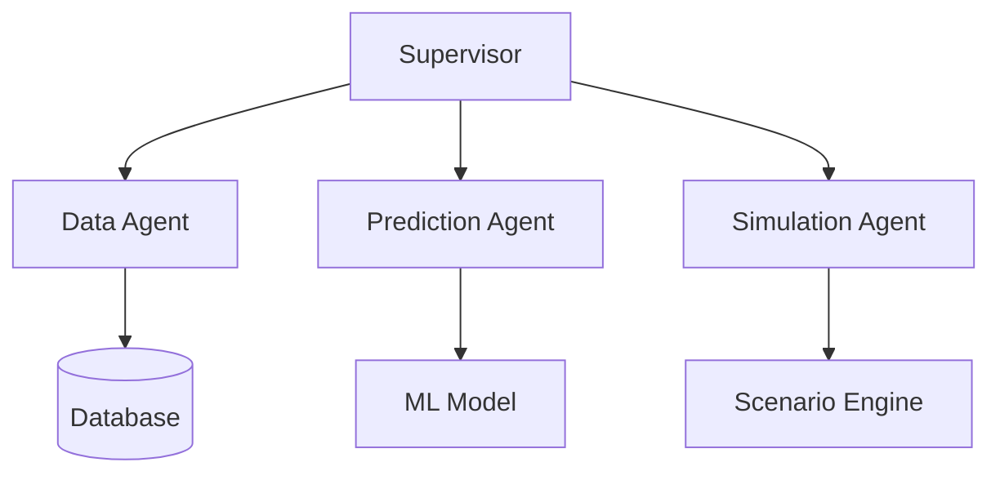

# Predictive Maintenance System

A comprehensive system for industrial machine monitoring and predictive maintenance using sensor data analysis and machine learning.

## Project Overview

This project implements a multi-agent system that collects sensor data from industrial machines, analyzes patterns, and predicts potential failures before they occur. It provides a complete infrastructure for monitoring machine health, scheduling maintenance, and simulating different scenarios.

## Key Features

- Real-time sensor data monitoring
- Machine learning-based failure prediction
- Machine-specific threshold configuration
- Historical data analysis
- What-if scenario simulation
- REST API for frontend integration

## System Architecture

The system consists of several microservices (agents) that work together:



- **Supervisor Service** - Coordinates communication between agents (port 5000)
- **Data Agent** - Fetches live machine data from database (port 5001)
- **Prediction Agent** - Runs ML predictions on incoming data (port 5002)
- **Simulation Agent** - Performs what-if scenario modeling (port 5003)

## System Requirements

- Python 3.10.16 (higher versions might cause problems with some of the requiered packages)
- PostgreSQL database
- Required Python packages (see requirements.txt)

## Quick Start

### 1. Clone the Repository

```bash
git clone <repository-url>
cd predictive-maintenance
```

### 2. Run Setup Script

```bash
# Run setup using the Makefile
make setup
```

This will:
- Install required Python packages
- Create .env file from template (adjust as needed)
- Set up PostgreSQL database
- Initialize database schema and defaults
- Create placeholder ML model

### 3. Start the System

```bash
make run
```

Select option 1 to start all agents or select specific agents to run.

### 4. System Management

To stop or reboot agents:

```bash
# Open the stop/reboot interface
make stop-reboot

# Or use direct commands:
make stop      # Stop all agents
make reboot    # Reboot all agents
make status    # Show agent status
```

This provides a menu-driven interface to:
- Stop all agents
- Reboot all agents
- Stop or reboot individual agents
- View system status

## Makefile Usage

The project includes a Makefile that allows you to run the system scripts without requiring execute permissions:

```bash
make           # Display available commands
make setup     # Set up the system
make run       # Run the system
make stop      # Stop all agents
make reboot    # Reboot all agents
make status    # Display agent status
make stop-reboot # Open the stop/reboot interface
```

This is especially useful when pulling the code into a new environment where file permissions might not be preserved.

## Configuration

The system is configured through a `.env` file. An example template is provided in `.env.example`:

```
DB_HOST=localhost
DB_NAME=predictive_maintenance
DB_USER=your_username
DB_PASSWORD=your_password
DATA_AGENT_PORT=5001
SUPERVISOR_PORT=5000
PREDICTION_AGENT_PORT=5002
SIMULATION_AGENT_PORT=5003
```

Copy this file to `.env` and update the values according to your environment. The setup script will do this for you and prompt you to edit the values.

## Database Structure

The system uses a PostgreSQL database with the following tables:

1. **machines** - Information about each machine being monitored
2. **sensor_data** - Time-series sensor readings from the machines
3. **predictions** - Machine learning predictions for potential failures
4. **simulations** - Data about simulation scenarios run on machines
5. **maintenance** - Records of maintenance activities
6. **defaults** - System-wide and machine-specific threshold values and configuration

See the [Database README](data/README.md) for detailed schema information and database setup instructions.

## API Documentation

The system exposes several REST API endpoints:

### Supervisor Endpoints

- `GET /health` - System health check
- `GET /machine_list` - Get simplified list of machine IDs and names
- `GET /machine_defaults` - Get machine-specific threshold values (averaged min/max)
- `POST /predict` - Get machine predictions
- `POST /simulate` - Run scenario simulation

### Data Agent Endpoints

- `GET /health` - Agent health check
- `GET /machines` - Get all machine details
- `GET /machine_list` - Get simplified list of machine IDs and names
- `GET /live_data` - Get latest sensor readings
- `GET /historical_data` - Get historical sensor data
- `GET /defaults` - Get system and machine-specific thresholds

For complete API documentation, see the [Agents README](agents/README.md).

## Example Usage

```python
import requests

# Get list of machines
machines = requests.get("http://localhost:5000/machine_list")
print(machines.json())

# Get machine-specific thresholds with averaged values
machine_defaults = requests.get("http://localhost:5000/machine_defaults?machine_id=M001")
print(machine_defaults.json())

# Example output:
# {
#   "machine_id": "M001",
#   "machine_name": "Precision milling machine", 
#   "machine_type": "Milling",
#   "afr": "12.5",
#   "rpm": "3200", 
#   "current": "30.0",
#   "pressure": "5.0",
#   "temperature": "72.5",
#   "vibration_max": "5.0"
# }

# Get prediction
prediction = requests.post("http://localhost:5000/predict", 
                          json={"machine_id": "M001"})
print(prediction.json())
```

## Project Structure

- **agents/** - Agent implementations
  - **data_agent/** - Database interaction agent
  - **prediction_agent/** - ML prediction agent
  - **simulation_agent/** - Scenario simulation agent
  - **supervisor/** - Agent coordination service
  - **models/** - Machine learning model files
- **data/** - Database schema and sample data
- **chat/** - Chat interface components
- **setup.sh** - System setup script
- **run.sh** - Script to start the system
- **stop_reboot.sh** - Script to manage running agents

## Detailed Documentation

- [Agents README](agents/README.md) - Details on the multi-agent architecture and API endpoints
- [Data README](data/README.md) - Database schema, setup instructions, and data import procedures
- [Chat Components](chat/) - Chat interface functionality

## Troubleshooting

If you encounter issues:

1. Check if the PostgreSQL database is running
2. Verify the environment variables in `.env` are correct
3. Check agent logs for specific error messages
4. Use the status display in `./run.sh` or `./stop_reboot.sh` to verify which agents are running
5. Ensure all required ports are available and not blocked by firewall
