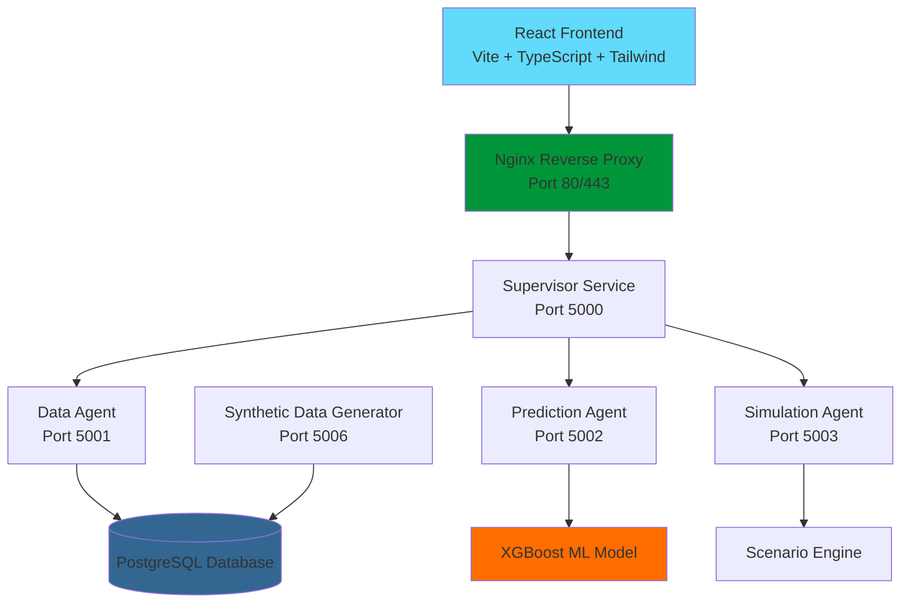

# Predictive Maintenance System

A comprehensive system for industrial machine monitoring and predictive maintenance using sensor data analysis and machine learning.

## Project Overview

This project implements a multi-agent system that collects sensor data from industrial machines, analyzes patterns, and predicts potential failures before they occur. It provides a complete infrastructure for monitoring machine health, scheduling maintenance, and simulating different scenarios.

## Key Features

- Real-time sensor data monitoring
- Machine learning-based failure prediction
- Machine-specific threshold configuration
- Historical data analysis
- What-if scenario simulation
- REST API for frontend integration

## System Architecture

The system consists of a React frontend and several backend microservices (agents) that work together:



### Backend Services
- **Supervisor Service** - Coordinates communication between agents and serves API endpoints (port 5000)
- **Data Agent** - Fetches live machine data from database (port 5001)
- **Prediction Agent** - Runs XGBoost ML predictions on incoming sensor data (port 5002)
- **Simulation Agent** - Performs what-if scenario modeling (port 5003)
- **Synthetic Data Generator** - Creates realistic machine data with anomalies for testing (port 5006)

### Frontend Stack
- **React 18+** - User interface framework
- **Vite** - Fast build tool and development server
- **TypeScript** - Type-safe JavaScript development
- **Tailwind CSS** - Utility-first CSS framework
- **Node.js** - JavaScript runtime for development and build processes

### Production Infrastructure
- **Nginx** - Reverse proxy server for API routing and static file serving
- **PostgreSQL** - Primary database for sensor data and predictions

## Prerequisites

### System Requirements

- **Operating System**: Linux (preferred), macOS, or Windows with WSL
- **Hardware**: 
  - **Minimum**: 4GB RAM, 4 CPU cores, 15GB disk space
  - **Recommended**: 8GB RAM, 6 CPU cores, 30GB disk space
  - **Production**: 16GB RAM, 8 CPU cores, 50GB disk space
- **Software**:
  - **Backend Requirements**:
    - Python 3.10.16 (higher versions might cause compatibility issues with some packages)
    - PostgreSQL 13.0 or higher
    - Git (for cloning the repository)
  - **Frontend Requirements** (for complete system deployment):
    - Node.js 18.x or higher
    - npm 8.x or yarn 1.22.x or higher
    - Nginx 1.18 or higher (for production deployment)
- **Network**: 
  - Backend services use ports 5000-5006
  - Frontend development server typically uses port 3000
  - Production deployment uses ports 80/443 (HTTP/HTTPS)
  - Ensure firewall allows communication between frontend and backend services

### PostgreSQL Setup

1. Install PostgreSQL:
   ```bash
   # For Ubuntu/Debian
   sudo apt update
   sudo apt install postgresql postgresql-contrib

   # For macOS (with Homebrew)
   brew install postgresql
   brew services start postgresql

   # For Windows
   # Download and install from https://www.postgresql.org/download/windows/
   ```

2. Create database and user:
   ```bash
   sudo -u postgres psql
   ```

   Then in the PostgreSQL prompt:
   ```sql
   CREATE DATABASE predictive_maintenance;
   CREATE USER predictive WITH PASSWORD 'your_secure_password';
   GRANT ALL PRIVILEGES ON DATABASE predictive_maintenance TO predictive;
   \q
   ```

## Complete Installation Guide

### 1. Clone the Repository

```bash
git clone <repository-url>
cd predictive-maintenance
```

### 2. Set Up Python Environment

```bash
# Create and activate a virtual environment
python -m venv venv

# On Linux/macOS
source venv/bin/activate

# On Windows
venv\Scripts\activate

# Install required packages
pip install -r requirements.txt
```

### 3. Configure Environment Variables

```bash
# Copy example environment file
cp .env.example .env

# Edit the .env file with your database credentials and other settings
nano .env  # or use any text editor
```

Required configuration in `.env`:
```
DB_HOST=localhost
DB_NAME=predictive_maintenance
DB_USER=predictive
DB_PASSWORD=your_secure_password
DATA_AGENT_PORT=5001
SUPERVISOR_PORT=5000
PREDICTION_AGENT_PORT=5002
SIMULATION_AGENT_PORT=5003
SYNTHETIC_DATA_PORT=5006
```

### 4. Initialize Database

```bash
# Initialize database schema
psql -U predictive -d predictive_maintenance -f data/schema.sql

# Load default values (optional)
psql -U predictive -d predictive_maintenance -f data/defaults.sql
```

### 5. Automated Setup (Alternative to steps 2-4)

The project includes a setup script that automates the environment setup:

```bash
# Run setup using the Makefile
make setup

# Or run the setup script directly
./setup.sh
```

This will:
- Install required Python packages
- Create `.env` file from template (you'll be prompted to edit)
- Set up database schema
- Initialize database defaults
- Create placeholder ML model if needed

## Running the System

### Starting All Components

For first-time users, the easiest way to start the system is using the run script:

```bash
# Using Makefile
make run

# Or directly
./run.sh
```

This will present a menu to:
- Start all agents
- Start specific agents
- View system status

### Starting Individual Components

If you need more control, you can start each component separately:

```bash
# Start supervisor agent
python agents/supervisor/app.py

# Start data agent
python agents/data_agent/app.py

# Start prediction agent
python agents/prediction_agent/app.py

# Start simulation agent
python agents/simulation_agent/app.py

# Start synthetic data generator
python synthetic_data_generator.py
```

Note: The recommended startup order is:
1. Data Agent
2. Prediction Agent
3. Simulation Agent
4. Supervisor Agent
5. Synthetic Data Generator

### Verifying Successful Startup

To confirm all components are running correctly:

1. Check health endpoints:
   ```bash
   curl http://localhost:5000/health  # Supervisor
   curl http://localhost:5001/health  # Data Agent
   curl http://localhost:5002/health  # Prediction Agent
   curl http://localhost:5003/health  # Simulation Agent
   curl http://localhost:5006/health  # Synthetic Data Generator
   ```

2. Check for live data:
   ```bash
   curl http://localhost:5001/live_data
   ```

3. View logs:
   ```bash
   # View synthetic data generator logs
   ./view_synthetic_data_log.sh
   
   # View general logs
   ./view_logs.sh
   ```

## System Management

### Managing Running Agents

```bash
# Open the management interface
make stop-reboot
# Or
./stop_reboot.sh
```

This interface allows you to:
- Stop all agents
- Reboot all agents
- Stop or reboot individual agents
- View system status

### Direct Commands

```bash
make stop      # Stop all agents
make reboot    # Reboot all agents
make status    # Show agent status
```

### Log Files

The system generates various log files:

- **General logs**: Located in the `logs/` directory
- **Synthetic data logs**: `logs/synthetic_data.log`
- **Agent-specific logs**: Located in the respective agent directories

To view logs in real-time:
```bash
tail -f logs/synthetic_data.log
```

## Data Generation and Simulation

### Synthetic Data Generator

The system includes a synthetic data generator that creates realistic machine sensor data, including anomaly patterns that can lead to failures. This component:

1. Generates baseline sensor readings for all machines
2. Periodically introduces anomalies that develop over time
3. Saves data to both the `sensor_data` and `prediction_data` tables
4. Automatically triggers predictions when new data is available

The generator runs on a 30-second cycle by default and introduces anomalies randomly with configurable probabilities.

### Running Predictions

Predictions are automatically triggered when new data is saved to the `prediction_data` table. To manually trigger a prediction:

```bash
curl -X POST http://localhost:5002/predict -H "Content-Type: application/json" -d '{"machine_id": "M001"}'
```

### Running Simulations

To run a what-if simulation:

```bash
curl -X POST http://localhost:5003/simulate -H "Content-Type: application/json" -d '{
  "machine_id": "M001",
  "scenario": "temperature_increase",
  "parameters": {
    "increase_amount": 15,
    "duration_hours": 4
  }
}'
```

## Troubleshooting Guide

### Common Issues and Solutions

1. **Database Connection Issues**
   - Verify PostgreSQL is running: `pg_isready`
   - Check database credentials in `.env`
   - Ensure the database exists: `psql -U postgres -c "SELECT datname FROM pg_database"`

2. **Agent Won't Start**
   - Check if port is already in use: `netstat -tuln | grep PORT_NUMBER`
   - Verify the agent's dependencies are running (e.g., data agent must be running for prediction agent)
   - Check log files for specific error messages

3. **No Predictions Generated**
   - Verify prediction agent is running: `curl http://localhost:5002/health`
   - Check if there's data in the `prediction_data` table
   - Manually trigger a prediction to see if there are errors

4. **Missing Libraries or Modules**
   - Ensure virtual environment is activated
   - Reinstall dependencies: `pip install -r requirements.txt`

### Diagnostic Commands

```bash
# List running Python processes
ps aux | grep python

# Check database tables
psql -U predictive -d predictive_maintenance -c "SELECT COUNT(*) FROM sensor_data"
psql -U predictive -d predictive_maintenance -c "SELECT COUNT(*) FROM predictions"

# Check prediction data for a specific machine
curl http://localhost:5001/prediction-data/M001
```

## Advanced Configuration

### Environment Variables

Key environment variables that can be configured in `.env`:

| Variable | Description | Default |
|----------|-------------|---------|
| DB_HOST | PostgreSQL host | localhost |
| DB_NAME | Database name | predictive_maintenance |
| DB_USER | Database username | - |
| DB_PASSWORD | Database password | - |
| SUPERVISOR_PORT | Supervisor agent port | 5000 |
| DATA_AGENT_PORT | Data agent port | 5001 |
| PREDICTION_AGENT_PORT | Prediction agent port | 5002 |
| SIMULATION_AGENT_PORT | Simulation agent port | 5003 |
| SYNTHETIC_DATA_PORT | Synthetic data generator port | 5006 |
| PREDICTION_HORIZON_DAYS | Days to predict ahead | 30 |
| DATA_INTERVAL_SECONDS | Seconds between data generation | 30 |
| PREDICTION_INTERVAL_ITERATIONS | Iterations between writing to prediction_data | 60 |

### Fine-tuning the ML Model

The prediction system uses a trained XGBoost model. To retrain or fine-tune:

1. Collect sufficient failure data
2. Adjust hyperparameters in `predictive_model.py`
3. Run training:
   ```bash
   python inference/run_grid_search.py
   ```

### Frontend Integration

The React frontend (deployed separately) communicates with the backend services through the following:

1. **API Integration**: Frontend makes HTTP requests to the Supervisor service at `http://localhost:5000` (development) or through Nginx reverse proxy (production)

2. **CORS Configuration**: Backend services include Flask-CORS to enable cross-origin requests from the frontend

3. **Environment Configuration**: Frontend should be configured with:
   ```env
   VITE_API_BASE_URL=http://localhost:5000  # Development
   VITE_API_BASE_URL=https://yourdomain.com/api  # Production
   ```

### Production Deployment Considerations

For production deployment:
- **Backend**: Use a process manager like Supervisor or PM2
- **Frontend**: Build React app with `npm run build` and serve via Nginx
- **Reverse Proxy**: Configure Nginx to proxy API requests to backend services:
  ```nginx
  location /api/ {
      proxy_pass http://localhost:5000/;
      proxy_set_header Host $host;
      proxy_set_header X-Real-IP $remote_addr;
  }
  
  location / {
      try_files $uri $uri/ /index.html;
      root /var/www/predictive-maintenance;
  }
  ```
- **Database**: Configure proper PostgreSQL backups and security
- **Security**: Implement proper authentication for API endpoints and HTTPS

#### Docker Deployment (Optional)

The system can be containerized using Docker:

1. Build images:
   ```bash
   docker build -t predictive-maintenance-supervisor -f Dockerfile.supervisor .
   # Repeat for other agents
   ```

2. Create a docker-compose.yml file for orchestration
3. Run with `docker-compose up`

## API Documentation

### Supervisor Endpoints

- `GET /health` - System health check
- `GET /machine_list` - Get simplified list of machine IDs and names
- `GET /machine_defaults` - Get machine-specific threshold values (averaged min/max)
- `POST /predict` - Get machine predictions
- `POST /simulate` - Run scenario simulation

### Data Agent Endpoints

- `GET /health` - Agent health check
- `GET /machines` - Get all machine details
- `GET /machine_list` - Get simplified list of machine IDs and names
- `GET /live_data` - Get latest sensor readings
- `GET /live_data?machine_id=M001` - Get latest sensor readings for a specific machine
- `GET /historical_data` - Get historical sensor data
- `GET /defaults` - Get system and machine-specific thresholds

### Prediction Agent Endpoints

- `GET /health` - Agent health check
- `POST /predict` - Run prediction for a machine

### Simulation Agent Endpoints

- `GET /health` - Agent health check
- `POST /simulate` - Run a simulation scenario

For complete API documentation, see the [Agents README](agents/README.md).

## Example Usage

```python
import requests

# Get list of machines
machines = requests.get("http://localhost:5000/machine_list")
print(machines.json())

# Get machine-specific thresholds with averaged values
machine_defaults = requests.get("http://localhost:5000/machine_defaults?machine_id=M001")
print(machine_defaults.json())

# Example output:
# {
#   "machine_id": "M001",
#   "machine_name": "Precision milling machine", 
#   "machine_type": "Milling",
#   "afr": "12.5",
#   "rpm": "3200", 
#   "current": "30.0",
#   "pressure": "5.0",
#   "temperature": "72.5",
#   "vibration_max": "5.0"
# }

# Get prediction
prediction = requests.post("http://localhost:5000/predict", 
                          json={"machine_id": "M001"})
print(prediction.json())
```

## Project Structure

- **agents/** - Agent implementations
  - **data_agent/** - Database interaction agent
  - **prediction_agent/** - ML prediction agent
  - **simulation_agent/** - Scenario simulation agent
  - **supervisor/** - Agent coordination service
  - **models/** - Machine learning model files
  - **pids/** - Process ID files for running agents
- **data/** - Database schema and sample data
- **chat/** - Chat interface components
- **inference/** - Machine learning model inference code
- **logs/** - Log files directory
- **training/** - Model training code and data
- **setup.sh** - System setup script
- **run.sh** - Script to start the system
- **stop_reboot.sh** - Script to manage running agents
- **synthetic_data_generator.py** - Generates synthetic sensor data

## Detailed Documentation

- [Agents README](agents/README.md) - Details on the multi-agent architecture and API endpoints
- [Data README](data/README.md) - Database schema, setup instructions, and data import procedures
- [Chat Components](chat/) - Chat interface functionality

## Maintenance and Updates

### Backup Procedures

1. **Database Backup**:
   ```bash
   pg_dump -U predictive predictive_maintenance > backup_$(date +%Y%m%d).sql
   ```

2. **Configuration Backup**:
   ```bash
   cp .env .env.backup_$(date +%Y%m%d)
   ```

### Upgrading the System

1. Pull the latest code:
   ```bash
   git pull origin main
   ```

2. Update dependencies:
   ```bash
   pip install -r requirements.txt
   ```

3. Apply any database migrations (if provided)
4. Restart the system:
   ```bash
   make reboot
   ```

## Support and Contributing

For support issues, please contact the project maintainers or create an issue in the project repository.

Contributions are welcome - please follow the standard GitHub pull request process and ensure all tests pass before submitting.
