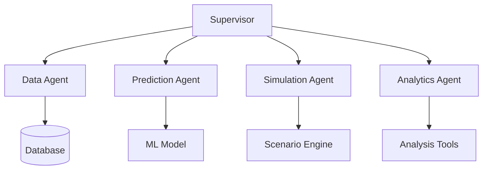

# Digital Twin for Predictive Maintenance

A multi-agent system for predictive maintenance of industrial machines using sensor data and machine learning.

## System Architecture



## Components

1. **Supervisor Service** - Coordinates communication between agents (port 5000)
2. **Data Agent** - Fetches live machine data from database (port 5001)
3. **Prediction Agent** - Runs ML predictions on incoming data (port 5002)
4. **Simulation Agent** - Performs what-if scenario modeling (port 5003)  
5. **Analytics Agent** - Analyzes results and compares scenarios (port 5004)

## Pre-requisites

Python version 3.10

## Installation

1. Clone the repository
2. Create and activate virtual environment:
   ```bash
   python -m venv venv
   source venv/bin/activate  # Linux/Mac
   venv\Scripts\activate    # Windows
   ```
3. Install dependencies:
   ```bash
   pip install -r requirements.txt
   ```

## Configuration

1. Copy `.env.example` to `.env`
2. Update environment variables:
   - Database credentials
   - Model paths
   - API keys
   - Port configurations

## Running the System

Start each service in separate terminals:

```bash
# Supervisor
python digital_twin/supervisor/app.py

# Data Agent  
python digital_twin/data_agent/app.py

# Prediction Agent
python digital_twin/prediction_agent/app.py

# Simulation Agent
python digital_twin/simulation_agent/app.py

# Analytics Agent
python digital_twin/analytics_agent/app.py
```

## API Documentation

### Supervisor Endpoints

- `GET /health` - System health check
- `POST /predict` - Get machine predictions
- `POST /simulate` - Run scenario simulation
- `POST /analyze` - Analyze results
- `POST /compare` - Compare scenarios

## Example Usage

```python
import requests

# Get system health
response = requests.get("http://localhost:5000/health")
print(response.json())

# Get prediction
prediction = requests.post("http://localhost:5000/predict", json={
    "machine_id": "M123",
    "sensor_readings": {...}
})
print(prediction.json())
